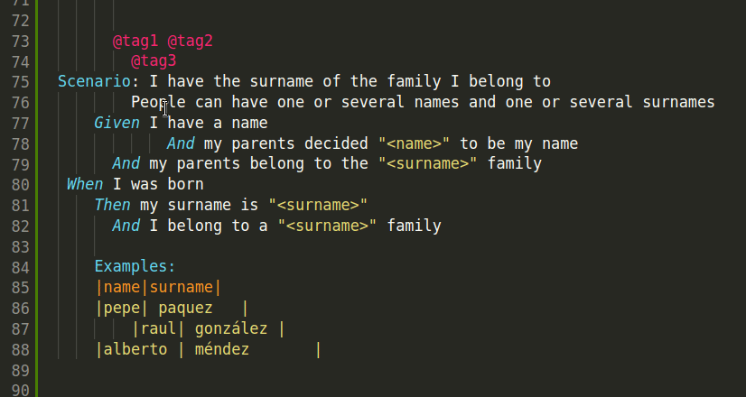

# Gherkiner

This extension makes a simple format of Gherkin feature files by modifying the line indent depending on the words starting the line

## Value added

The value added by this extension compared with others is the possibility of including padding for lines
beginning with custom strings. This way you are not limitted to Gherkin standard nomenclature or to the used language in the feature.
For example, suppose that your features definition include some actions in a section called _Before Action_. You can set a dedicated
padding for the lines beginning with _Before Action_. Besides, the default padding could be used to define the indent of the rest of lines
in that section. 

 * Lines starting with 'Before Action' having a padding of 2 spaces
 * Default padding set to 4 spaces

produces something like

```
  Before Action:
    Anything you need here
    will have a padding of 4 spaces
    as indicated in the default padding
```
## Features

 * Define the padding to apply to a certain line depending on the words starting such line. For example, all lines starting with 'Given' have a padding of 4. Lines starting with 'Scenario Outline' have a padding of 2. There is not an specific set of words or phrases to consider for the padding with default values, so you need to define each one you want the extension to consider

 * Define a padding to apply for the lines having tables
 
 * Default padding. You can define a common padding for all the not empty lines that have not an specific padding

 * Table formatting. Tables in the document are autoformatted

 * Tags take the padding of the section they apply to. For example, tags for scenarios take the same padding that the one defined for the lines stating with 'Scenario' word

 * Padding symbol. Set space or tab as the symbol to pad the lines

 * Format on save. There is a contextual menu entry to apply the format to the current open features file, but you can also enable the formatting when saving the document

## Usage



There are two options to use the extension:
 + **On demand**. Configure the extension as the formater for *.feature* files and select the contextual menu option **Format Document**
 + **On file save**. This only works if _gherkiner.formatOnSave_ flag is set

## Settings

Define the extension settings in the _.vscode/settings.json_ file

| Setting | Description | Type |Default value |
|---------|-------------|------|---------------|
| gherkiner.formatOnSave | indicates whether formatting the feature when saving the file | boolean | false |
| gherkiner.padding.symbol | the symbol ('tab' or 'space') to use for padding the lines | string | space |
| gherkiner.padding.default | how many symbols to pad for all the regular lines whose padding has not been explicitly set | integer | (not set) |
| gherkiner.padding.table | the padding to apply to lines belonging to tables | integer | (not set) |
| gherkiner.paddings | list of specific prefixes and their paddings to apply | array of {string: int} elements | [ ] |

<br/>
Here's an example configuration that aligns vertically, after the prefix, the Given, When, And and Then:

```json
{
    ...

    "gherkiner.padding.symbol": "space",
    "gherkiner.padding.default": 4,
    "gherkiner.padding.table": 10,
    "gherkiner.formatOnSave": true,
    "gherkiner.paddings": [
        {
            "keyword": "Feature",
            "padding": 0
        },
        {
            "keyword": "Scenario",
            "padding": 2
        },
        {
            "keyword": "Given",
            "padding": 4
        },
        {
            "keyword": "When",
            "padding": 5
        },
        {
            "keyword": "Then",
            "padding": 5
        },
        {
            "keyword": "And",
            "padding": 6
        },
        {
            "keyword": "But",
            "padding": 6
        },
        {
            "keyword": "Backgroud",
            "padding": 2
        },
        {
            "keyword": "Before Action",
            "padding": 2
        },
        {
            "keyword": "Examples",
            "padding": 4
        },
        {
            "keyword": "#",
            "padding": 0
        }
    ],
    ...
}
```

## Issues

Feel free to file issues [here](https://github.com/rmescandon/gherkiner/issues)

## Disclaimer

This extension is provided as-is. No support is guaranteed

## Thank you

If you like this extension, please [start](https://github.com/rmescandon/gherkiner/stargazers) it. If not, sorry, but you didn't tell me how to make it well and what's even worse, you didn't [contribute](https://github.com/rmescandon/gherkiner/pulls) to make it well
