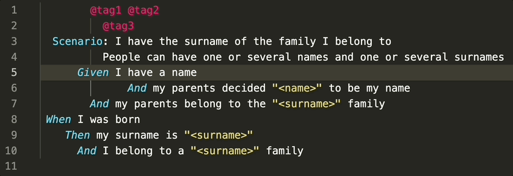

# Gherkiner

This extension makes a simple format of Gherkin feature files by modifying the line indent depending on the words starting the line

## Features

 * Define the padding to apply to a certain line depending on the words starting such line. For example, all lines starting with 'Given' have a padding of 4. Lines starting with 'Scenario Outline' have a padding of 2. There is not an specific set of words or phrases to consider for the padding with default values, so you need to define each one you want the extension to consider

 * Define a padding to apply for the lines having tables
 
 * Default padding. You can define a common padding for all the not empty lines that have not an specific padding

 * Table formatting. Tables in the document are autoformatted

 * Tags take the padding of the section they apply to. For example, tags for scenarios take the same padding that the one defined for the lines stating with 'Scenario' word

 * Padding symbol. Set space or tab as the symbol to pad the lines

 * Format on save. There is a contextual menu entry to apply the format to the current open features file, but you can also enable the formatting when saving the document

## Usage



There are two options to use the extension:
 + Selecting the contextual menu option **format feature**
 + **On file save**. This only works if _gherkiner.formatOnSave_ flag is set

## Settings

Define the extension settings in the _.vscode/settings.json_ file

| Setting | Description | Type |Default value |
|---------|-------------|------|---------------|
| gherkiner.formatOnSave | indicates whether formatting the feature when saving the file | boolean | false |
| gherkiner.padding.symbol | the symbol ('tab' or 'space') to use for padding the lines | string | space |
| gherkiner.padding.default | how many symbols to pad for all the regular lines whose padding has not been explicitly set | integer | (not set) |
| gherkiner.padding.table | the padding to apply to lines belonging to tables | integer | (not set) |
| gherkiner.paddings | list of specific prefixes and their paddings to apply | array of {string: int} elements | [ ] |

<br/>
Here's an example configuration that aligns vertically, after the prefix, the Given, When, And and Then:

```json
{
    ...

    "gherkiner.padding.symbol": "space",
    "gherkiner.padding.default": 4,
    "gherkiner.padding.table": 10,
    "gherkiner.formatOnSave": true,
    "gherkiner.paddings": [
        {
            "keyword": "Feature",
            "padding": 0
        },
        {
            "keyword": "Scenario",
            "padding": 2
        },
        {
            "keyword": "Given",
            "padding": 4
        },
        {
            "keyword": "When",
            "padding": 5
        },
        {
            "keyword": "Then",
            "padding": 5
        },
        {
            "keyword": "And",
            "padding": 6
        },
        {
            "keyword": "But",
            "padding": 6
        },
        {
            "keyword": "Backgroud",
            "padding": 2
        },
        {
            "keyword": "Before Action",
            "padding": 2
        },
        {
            "keyword": "Examples",
            "padding": 4
        },
        {
            "keyword": "#",
            "padding": 0
        }
    ],
    ...
}
```

## Issues

Feel free to file issues [here](https://github.com/rmescandon/gherkiner/issues)

## Extension Settings

Include if your extension adds any VS Code settings through the `contributes.configuration` extension point.

For example:

This extension contributes the following settings:

* `myExtension.enable`: enable/disable this extension
* `myExtension.thing`: set to `blah` to do something

## Known Issues

Calling out known issues can help limit users opening duplicate issues against your extension.

## Release Notes

Users appreciate release notes as you update your extension.

### 1.0.0

Initial release of ...

### 1.0.1

Fixed issue #.

### 1.1.0

Added features X, Y, and Z.

-----------------------------------------------------------------------------------------------------------
## Following extension guidelines

Ensure that you've read through the extensions guidelines and follow the best practices for creating your extension.

* [Extension Guidelines](https://code.visualstudio.com/api/references/extension-guidelines)

## Working with Markdown

**Note:** You can author your README using Visual Studio Code.  Here are some useful editor keyboard shortcuts:

* Split the editor (`Cmd+\` on macOS or `Ctrl+\` on Windows and Linux)
* Toggle preview (`Shift+CMD+V` on macOS or `Shift+Ctrl+V` on Windows and Linux)
* Press `Ctrl+Space` (Windows, Linux) or `Cmd+Space` (macOS) to see a list of Markdown snippets

### For more information

* [Visual Studio Code's Markdown Support](http://code.visualstudio.com/docs/languages/markdown)
* [Markdown Syntax Reference](https://help.github.com/articles/markdown-basics/)

**Enjoy!**
